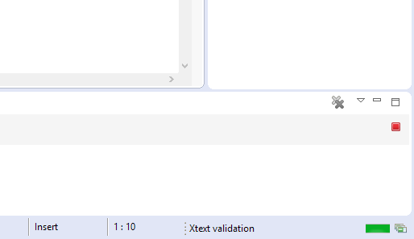

# Cardygan
## Overview
CardyGAn provides capabilities for CFM editing, automated CFM validation including anomaly detection.
CardyGAn offers the following functionality:
* **CFM editor** with textual syntax based on Xtext, and an integration of cardinality annotations into the exchange format of FeatureIDE.
* **CFM validation** for automated anomaly detection for CFM with potentially infinite configuration spaces based on a combination of ILP and SMT solvers.
* **CFM configuration engine** for staged CFM configuration.

## Installation
In Eclipse install CardyGAn via Updatesite: https://raw.githubusercontent.com/Echtzeitsysteme/cardygan/master/updatesite/

CardyGAn has been tested for Eclipse Mars.1
Additional features needed to run CardyGAn:
* Feature IDE 2.7: http://wwwiti.cs.uni-magdeburg.de/iti_db/research/featureide/
  * Updatesite: http://wwwiti.cs.uni-magdeburg.de/iti_db/research/featureide/deploy/ (Install *FeatureIDE* and *Feature Modeling*)
* XText 2.8: https://eclipse.org/Xtext/
  * Updatesite: http://download.eclipse.org/modeling/tmf/xtext/updates/composite/releases/ (Install Xtext > Xtext Complete SDK)

## Configure CardyGAn
### Set Solver Library path
For bound analysis CardyGAn relies either on Cplex, Gurobi 6.5 or GLPK as ILP-solvers.
For gap analysis CardyGAn currently supports smt-solver Z3.
As a requirement for usage of validation capabilties of CardyGAn one of the solvers need to be installed.
Thus, the corresponding native solver libraries need to be added to the native library path.
* To set the library path e.g. for *Gurobi* and *Z3* in *Mac OS X* invoke from the command line `export DYLD_LIBRARY_PATH=/Library/gurobi605/mac64/bin:<PATH>/z3-4.4.1-x64-osx-10.11/bin/:$DYLD_LIBRARY_PATH`
* To setup your system for the use of *Gurobi* and *Z3* in *Windows* make sure the following variables are modified in the **Environment Variables** (System > Advanced System Settings > Advanced Tab > Environmental Variables Button)
  * Z3's bin-subfolder has to be added to the **PATH** and to the **PYTHONPATH** variables. This location depends on the extraction folder of the zip-file (e.g. "C:\z3-4.3.2-x64-win\bin").
  * Gurobi's bin-subfolder should automatically be added to the **PATH** variable during the installation process. When using the installation wizard, the location should be `C:\gurobi650\win64\bin` or `C:\gurobi650\win32\bin` depending on your system.
  * Gurobi's home-subfolder should automatically be added to the **GUROBI_HOME** variable during the installation process. When using the installation wizard, the location should be `C:\gurobi650\win64` or `C:\gurobi650\win32` depending on your system.
  

### Set Solver Used for Analysis
Per default, CardyGAn uses *Gurobi* as ILP-solver and *Z3* as SMT-solver.
If you prefer to use another solver, add a corresponding `cardygan.properties`file to the project directory containing your CFM specifications. Currently configuration parameters `CPLEX`,`GLPK`and `GUROBI`(default) are supported.

For example, to use GLPK solver with Z3 add a `cardygan.properties`file at the root of a project directory:
```
ilpSolver=GUROBI
smtSolver=Z3
```

## Tutorial

Our Cardigan Eclipse-plugin can be used for the whole process of modeling cardinalty based feature models.

Besides the support of the modeling process itself it can be used to
* create or generate a cardinality based feature model
* generate and visualize a valid configuration for a your feature model
* create and validate your own configuration for your feature model
* export your feature model as an xml-file
	
### 1. Creating a Feature Model

To start using Cardygan from an empty workspace you first have to create a new Java Project. As a next step, create a new file inside the src-folder with a ".cardfmxt"-extension.


If Eclipse asks you, if you want to add the Xtext nature to your project, please confirm. If this dialog does not show up, please make sure, that the Xtext nature is added to your project manually.


Eclipse should now open your created file in a custom editor, that supports creating cardinality based feature models with syntax highlighting, code completion and warnings and errors regarding anomalies in cardinality intervals.
The following screenshot shows an example of the syntax of this kind of feature models.


A single feature without children is given by its cardinality interval and a uniqe name:
```
0..1 Feature Regular
```
If a feature has child features, the children are given in brackets and additional intervals are needed to specify the group type cardinalities and group instance cardinalities:
```
1..* Feature Channels -> @instance=1..* @type=1..2 {
	1..8 Feature HighThroughput
	1..32 Feature Reliable
}
```
The Kleene Star as an upper bound is used to state an unbounded interval and a potentially unlimited amount of instances.
After the tree structure of the features, it is optional to add some cross tree constraints. A cross tree constraints consists of a source and a target feature, both with a "guard interval", and an indicator if it is a require or an exclude constraint:
```
1..* Compact exclude 10..20 HighThroughput
```
Note that the given intervals of a cross tree constraint are based on the global amount of a features instances and not seen as a relative reference.

#### 1.1. Generating a feature model

Besides creating your own feature model from scratch, Cardygan comes with the possibility to automatically generate a cardinality based feature model. To use this feature you have to right click on an existing project with the Xtext nature already added.


You then have the possibility to chose a file location and set the following properties of the new feature model.


* Overall number of features: The number of features of the feature model
* Overall percentage of optional features: The relative number of features with an cardinality interval with a lower bound of 0
* Max. number of Instances per Feature: The maximum upper bound of cardinality intervals
* Overall percentage of unbounded Groups: The relative number of group instance cardinality intervals with a Kleene Star as upper bound
* Overall percentage of unbounded Features: The relative number of feature instance cardinality intervals with a Kleene Star as upper bound
* Overall percentage of unbounded Cross Tree Constraints: The relative number of cross tree constraint cardinality intervals with a Kleene Star as upper bound
* Number of Cross Tree Constraints in %: The cross tree constraint ratio (number of features used inside cross tree constraints, devided by the overall feature number)
* Feature has to be feasible: states if the generated feature model has to be feasible
	
Please note, that the explicit generation of a feasible feature model can lead to an error, if too many infeasible models are generated in a row.

### 2. Creating a Configuration

#### 2.1. Automatic generation and visualization

If you right click on the cardfmxt-file inside the project explorer or the editor and choose "Generate valid Configuration", a visualization of a configuration with concrete instances can be created.


As a step towards this visualization an upper bound of the amount of instances has to be chosen in the following dialog.


For the beginning we recommend to select the option "Use minimum amount", which tries to minimize the computation time. If a warning occurs, that a valid configuration could not be created with this settings, you should experiment with custom bounds. The reason behind this is, that our visualization is currently generated by Alloy (http://alloy.mit.edu/alloy/), which shows a bad runtime behaviour for an increasing number of features and instances.
If the generation succeeds you will see a new window with a tree-like structure, that represents the generated configuration.


#### 2.2. Manual creation

Besides the automatic generation of a configuration you have the possibility to create your own configuration step by step in an extra file. For this purpose you first have to create a new file with an ".cardfmconfig"-extension inside the same project, where your feature model is located.


In the next screenshot you can see a valid configuration of the previously shown featuremodel.


An instance is defined by its type and a unique name, divided by the character "$". The children of an instance have to be created in brackets following its instantiation.
The feature names used inside this configuration are automatically connected to a feature model inside the project. To avoid misunderstandings due to mixtures of different feature models or dublicate feature names, we recommend to only use one feature model and one configuration file per project. If this method is followed, a warning shows clearly if a used feature is available inside the feature model and if the tree structure is correct.


If you right click on the cardfmconfig-file inside the project explorer or the editor and choose "Validate full or partial configuration", Cardygan checks in the background if your currently created configuration is a valid configuration of your feature model.


This procedure might take a while and its progress is shown in the lower right corner of the Eclipse IDE.



We recommend to only activate one validation at time, as this process cannot be canceled and might be resource intensive for bigger feature models.
